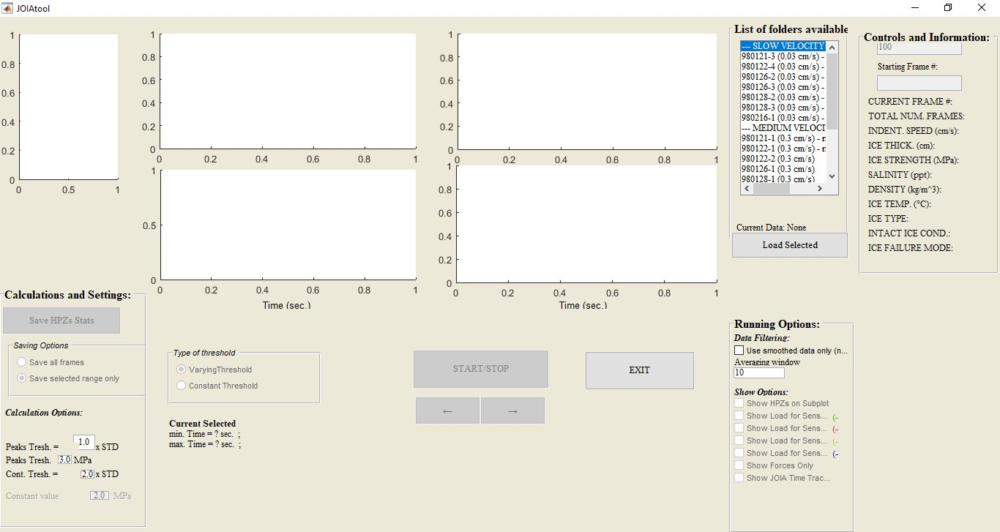
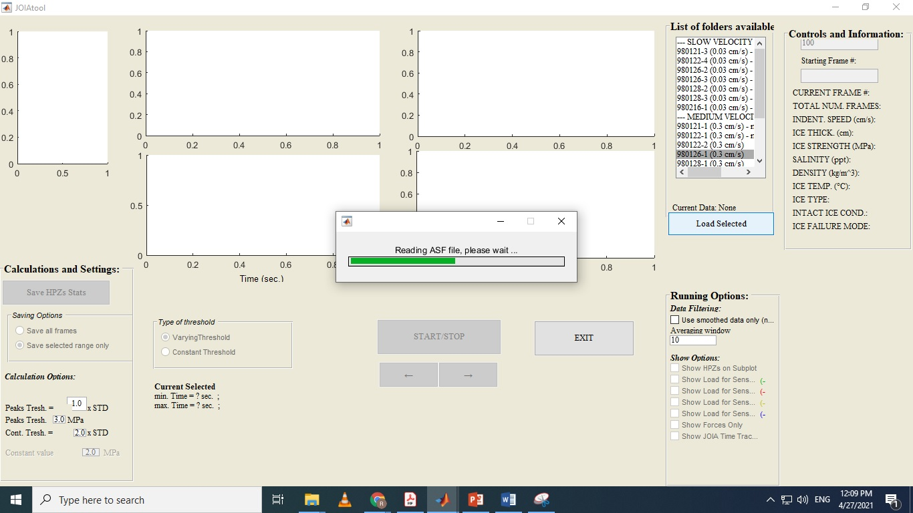
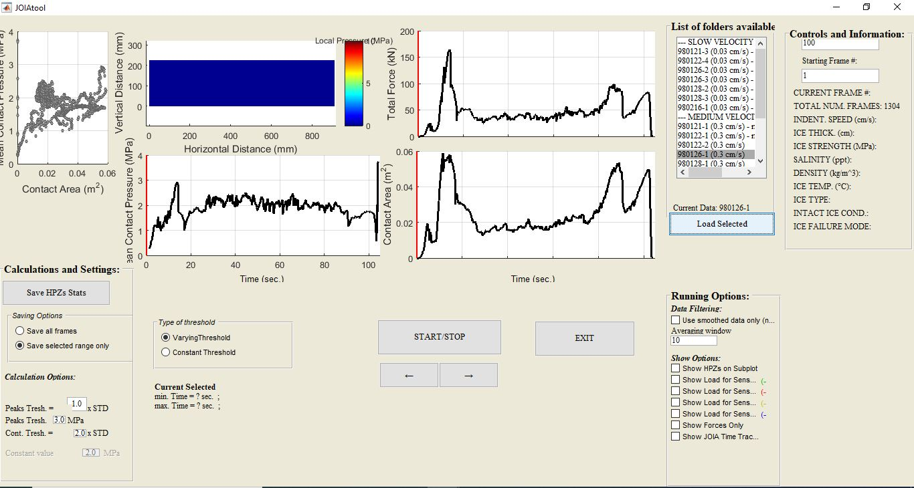
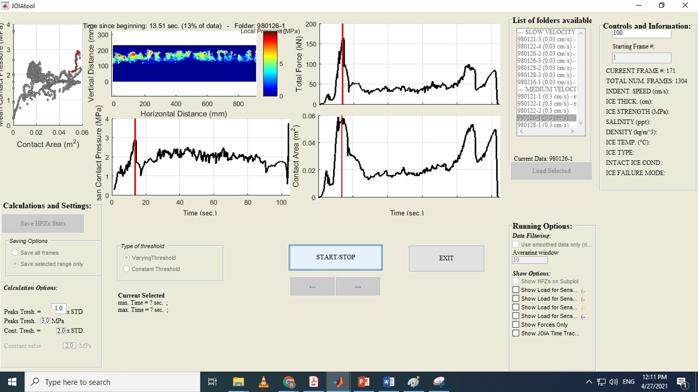

# JOIA-Data-Analysis
The repository contains the code for JOIA data analysis and visualization

The repository contains the scripts for the GUI tool for data visualization and saving high-pressure zones as time-series based on threshold defined by the user. Some of the functions were borrowed from work of Martin Richard, NRC, Canada. The data files are too large to upload in GitHub. Feel free to reach out to me if you are interested about this work. Sample data file is given in the sampleData folder. 

## Background
In an ice-structure interface, pressures are highly non-uniform both spatially and temporally. Current design practice uses uniform pressure patch for design which might not be appropriate for local design area (smaller components such as a welding joint) since the local pressure can be an order of magnitude higher than the average pressures. Furthermore, these local pressures, also termed as High Pressure Zones (HPZs) varies in time and their dynamic nature should also be considered during design. The work presented here is part of a new mathematical model development project considering the dynamic behavior of these HPZs. Here, results from the tests performed by Japan Ocean Industries Association (JOIA) is used to charcterize the dynamic behavior of HPZs and extract their time-series using IDL tracking algorithm (http://www.physics.emory.edu/faculty/weeks//idl/) . The GUI tool allows the user to quickly extract the HPZ characteristics with preferred threshold values and from the tests of their interest.

## Running the code
The tool can be run by running the JOIAtool_2019.m script in the src folder. Upon running the script MATLAB opens the JOIAtool_2019.fig. The user then can select the source of the data from the list of folders. The user can also provide inputs for the threshold value for HPZ calculation and enable additional visualization by clicking the checkboxes. Once the data is loaded, the user can start the data visualization by pressing START button. The HPZ data can be saved by pressing the SAVE HPZ button once the visualization is completed.

Here is a demo of the tool:

1. Running script generates the GUI 

2. Data for the selected test can be loaded using Load Button 

3. Loading complete

4. Running visualization upon pressing the Start Button

The details for JOIA tests can be found here (Sodhi, D. S., Takeuchi, T., Nakazawa, N., Akagawa, S., and Saeki, H., 1998, “Medium-Scale Indentation Tests on Sea Ice at Various Speeds,” Cold Reg. Sci. Technol., 28(3), pp. 161–182 DOI: 10.1016/S0165-232X(98)00017-2.)
